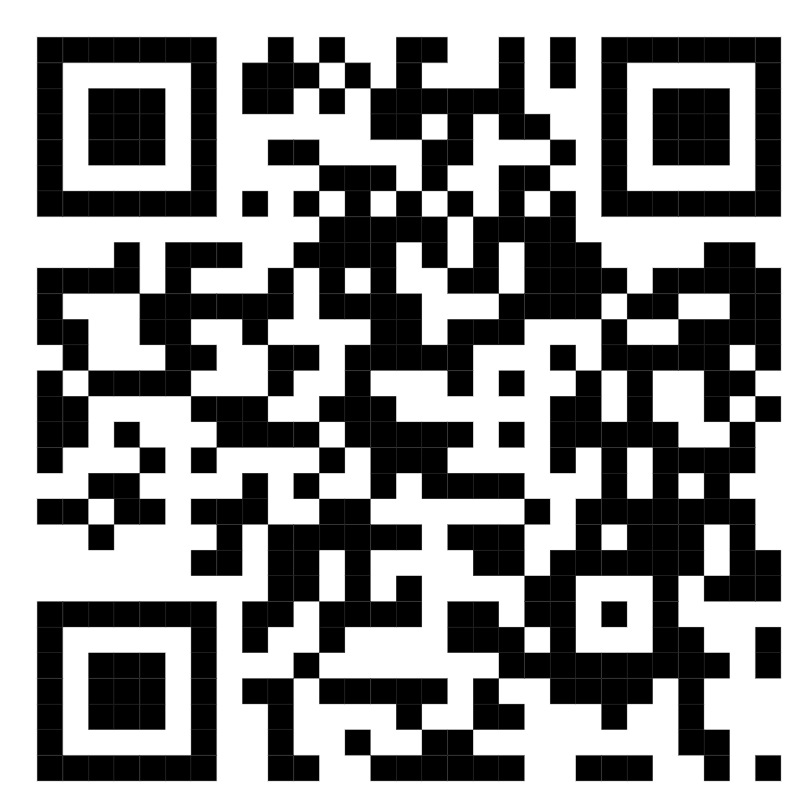

# UMNG_Escuela_Verano
Escuela de Verano Industria 4.0

# Industria 4.0 y oportunidades para Latinoamérica

| Conferencista                                                |    Materiales    |
|--------------------------------------------------------------|------------------|
| **Ricardo Raúl Palma**   
     Universidad Nacional de Cuyo 
 <ricardo.palma@ingenieria.uncuyo.edu.ar>                                   |  
https://github.com/ricardorpalma/UMNG_Escuela_Verano|

## Objetivos

1. **Comprender el contexto histórico y estructural de la Industria 4.0**
Analizar las revoluciones industriales previas (usando los ciclos de Kondratieff como marco), el ascenso y caída de potencias hegemónicas, y las fuentes energéticas que impulsaron cada revolución, para situar a la Industria 4.0 dentro de un proceso histórico más amplio y no como un fenómeno aislado.

2. **Analizar el reordenamiento geopolítico y económico global y su impacto en la región**
Utilizaremos para esta trabajo algunas herrameintas simple que tienen soporte en la IA Generativa para ayudarnos en la tarea
Estudiar el fin de la globalización tal como se conocía,    incluyendo fenómenos como el offshoring, nearshoring y friendshoring, los cambios en los modelos políticos de desarrollo, y cómo estas transformaciones —incluida la llamada "policrisis"— afectan las oportunidades productivas de América Latina.

3. **Desarrollar capacidades de construcción y análisis de escenarios prospectivos**
Aplicar metodologías como el método de escenarios de Herman Kahn y simulaciones tipo Montecarlo 2D, apoyándose en tecnologías emergentes (IoT/MQTT, programación sin código, gemelos digitales) para construir árboles de escenarios futuros aplicados a la industria regional.

4. **Formular propuestas concretas de desarrollo para países latinoamericanos y ponerlas en agenda**
Identificar y proponer "motores de desarrollo" específicos para países como Argentina, México, Brasil, Colombia y Chile, integrando el análisis histórico, geopolítico y prospectivo en un trabajo de evaluación final con potencial de publicación como capítulo de libro con ISBN/DOI.

# Contenidos y Materiales

## Parte 1 Revoluciones Industriales

* Revisión Histórica (Ciclos Kondratieff) <https://ricardorpalma.github.io/Kondratieff/#/title-slide>
* Industria 4.0 -  Papers fundacionales <https://github.com/ricardorpalma/UMNG_Escuela_Verano/blob/main/Papers/fundacional_actual.pdf>
* Uso de Herrmientas para nótas atómicas
* Ascenso y Caída de las poténcias Hegemónicas
* Las fuentes de energía de las revoluciones industriales
* El mundo que cambió en Diciembre de 2025  <https://github.com/ricardorpalma/UMNG_Escuela_Verano/tree/main/Obsidian/Policrisis>

## Parte 2 El fin de la globalización

* Evolución del protocolo de Kioto <https://zenodo.org/records/17262615>
* Trabajo de Investigación Industria 4.0 - Ciencia Reproducible Di3 <https://rpubs.com/ricardorpalma/1351475>
* Out shoring, Near Shoring, Friend Shoring
* Los modelos políticos de desarrollo (¿El fin de las democracias occidentales?)
* Producción de materiales y comunicación para la Innovación
* Entorno IDE para producción de contenidos <https://posit.cloud/>

### Propuestas para inspirar el trabajo de evaluación

* Revista de prensa <https://github.com/ricardorpalma/UMNG_Escuela_Verano/blob/main/Prensa.md>

     * La hora de los depredadores
     * El golpe de Estado de los tecnoautoritarios: de la América postdemocrática a la Europa que viene
     * Si no actuamos ya, imperios digitales en la sombra dictarán nuestras leyes
  
  
## Parte 3 Costrucción de escenarios

* Tecnologías Emergentes
    * Portocolo mqtt (mosquito)
    * Zero Coding Programing <https://nodered.org/>
    * Gemelos y Sombras Digitales Digitales <https://arxiv.org/abs/2506.12102> 
* Los think tanks
    * Real Instituto El Cano
    * CEPAL (Los términos de Intercambio) <https://www.youtube.com/watch?v=sqUQQX1dTx8&t=40s>
    * https://www.clingendael.org/
    * LEAP WEAP https://www.sei.org/
* El método de los escenarios de Herman Kahn
    * <https://themys.sid.uncu.edu.ar/rpalma/MBA/Simuladores/Escenarios/Autralia-Beer.html>
    
 
## Parte 4  Árboles de escenarios

* Uso de Intelegencia artificial para construir el escenario de Industria 4.0 <>
* Métod de Escenarios Montarcalo 2D (Estilo Herman Kahn)
* Arboles.rmd
* La Innovación en la región <https://ricardorpalma.github.io/AD_II_UMNG/redes-neuronales-artificiales.html>
* ~~Red Node y el protocolo mqtt~~
* 
## Parte 5 La Policrisis

Si tu trabajo (individual o con dos coautores) califica como uno de los mejores del curso te ofrezco publicarlo como capítulo de un libro con un DOI individual para cada trabajo es ISBN. Como verán en el prólogo este proyecto nuclea a muchos ingenieros de Latinoamérica, Caribe y Europa.

El proyecto del libro está en desarrollo y puedes consultarlo en <https://ricardorpalma.github.io/Marca_2026/>

*Escanarios posibles para la región.

    * Motores de Desarrollo de Argentina
    * Motores para Mexico
    * Motores para Brasil
    * Motores para Colombia
    * Motores para Chile

* Guia para la evaluación Final
